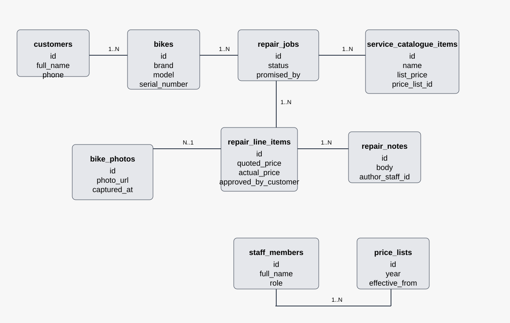

# Domain model

## Diagram



## DBML code

```dbml
Table customers {
  id int [pk, increment]
  full_name varchar
  phone varchar
  created_at datetime
}

Table bikes {
  id int [pk, increment]
  customer_id int [ref: > customers.id]
  brand varchar
  model varchar
  serial_number varchar
  created_at datetime
}

Table staff_members {
  id int [pk, increment]
  full_name varchar
  role varchar
  created_at datetime
}

Table repair_jobs {
  id int [pk, increment]
  bike_id int [ref: > bikes.id]
  customer_id int [ref: > customers.id]
  received_by_staff_id int [ref: > staff_members.id]
  promised_by date
  status varchar
  received_at datetime
  ready_at datetime
  picked_up_at datetime
  created_at datetime
  updated_at datetime
}

Table price_lists {
  id int [pk, increment]
  year int
  effective_from date
  effective_to date
  created_at datetime
}

Table service_catalogue_items {
  id int [pk, increment]
  price_list_id int [ref: > price_lists.id]
  name varchar
  list_price decimal
  created_at datetime
}

Table repair_line_items {
  id int [pk, increment]
  repair_job_id int [ref: > repair_jobs.id]
  service_catalogue_item_id int [ref: > service_catalogue_items.id]
  quoted_price decimal
  actual_price decimal
  approved_by_customer bool
  notes text
  created_at datetime
}

Table repair_notes {
  id int [pk, increment]
  repair_job_id int [ref: > repair_jobs.id]
  author_staff_id int [ref: > staff_members.id]
  body text
  created_at datetime
}

Table bike_photos {
  id int [pk, increment]
  bike_id int [ref: > bikes.id]
  photo_url varchar
  captured_at datetime
  caption text
}
```

## Lifecycle of a repair

The repair lifecycle is tracked via the `repair_jobs.status` field. The allowed flow is:

- `received` → `awaiting_diagnosis`
- `awaiting_diagnosis` → `quote_ready`
- `quote_ready` → `awaiting_customer_approval`
- `awaiting_customer_approval` → `in_progress`
- `in_progress` → `ready_for_pickup`
- `ready_for_pickup` → `picked_up`

Special cases from the description:

- A simple repair such as a flat tyre may move directly from `received` to `in_progress` if the work is obvious and no quote is necessary.
- If the customer rejects the quote, the bike can be returned to the customer without repair and the job becomes `declined` or `picked_up` once it is collected.

Not allowed transitions:

- `picked_up` cannot return to `in_progress`.
- `ready_for_pickup` cannot go back to `awaiting_customer_approval` once the customer has already accepted the quote.
- A job cannot move from `picked_up` back to `received` because the same repair is a completed record, not a new intake.

## Traceability: entity to story

| Entity | Story it supports |
|---|---|
| `customers` | Story 1, Story 2, Story 8, Story 14 |
| `bikes` | Story 3, Story 5, Story 11 |
| `staff_members` | Story 4, Story 6, Story 7, Story 10 |
| `repair_jobs` | Story 4, Story 7, Story 8, Story 10, Story 14 |
| `price_lists` | Story 9, Story 13 |
| `service_catalogue_items` | Story 7, Story 9, Story 13 |
| `repair_line_items` | Story 7, Story 8, Story 13 |
| `repair_notes` | Story 6, Story 11 |
| `bike_photos` | Story 5 |

## Decision notes required by the brief

### The thing and the copy of the thing

The model separates `bikes` from `repair_jobs` so that each physical bicycle is a unique object with its own serial number, model, and service history. That prevents the April/May confusion described by the owner: two blue Marlins may look the same, but the serial number and the `bike_id` distinguish the real object. A single table with a quantity column would fail to answer which specific bike received a replacement fork, which customer owned it at the time, and which earlier repair record belongs to the second owner after a sale.

### Derived, or stored?

We do not store a `is_overdue` column because it is derived from the repair's promised date and the current date. The business rule is simple: if the repair is not complete and the promised day has passed, then it is overdue. We do store `actual_price` on each repair line item even though it can look derivable from the published list price and a discount. That is deliberate because the business needs to preserve the agreed price for a historical invoice, especially when the annual price list changes and old invoices must not be rewritten.

## Required decisions and assumptions

The model assumes:

- each physical bike has one serial number and one identity regardless of owner changes;
- each repair job belongs to one bike and one customer at the time of intake;
- service prices are versioned by year and remain tied to the historical price list for each invoice.

Those assumptions are documented in [docs/decisions.md](decisions.md).
