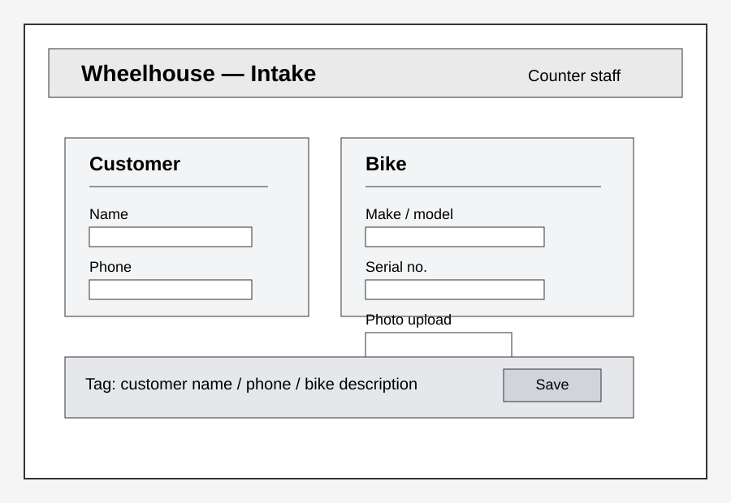
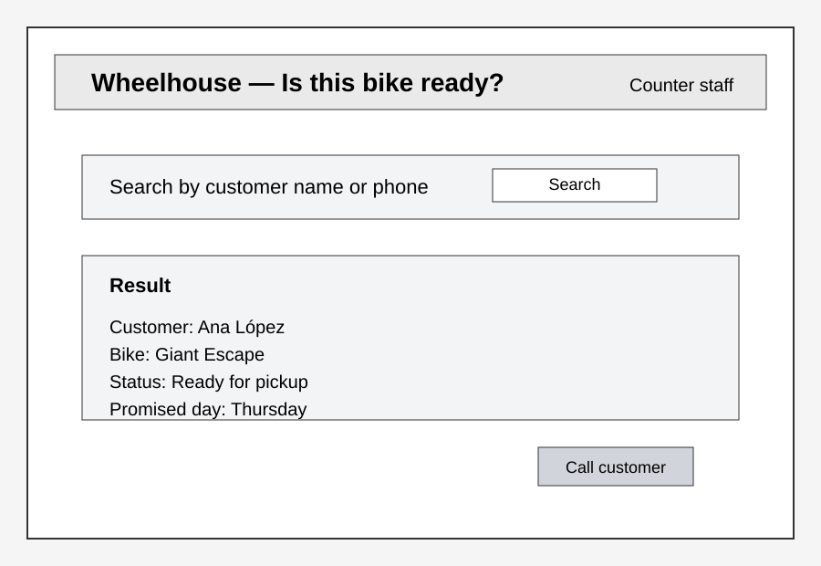
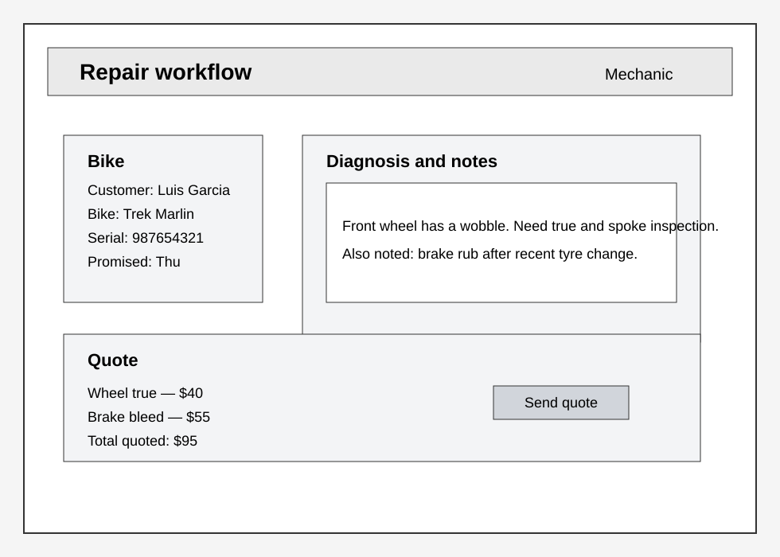
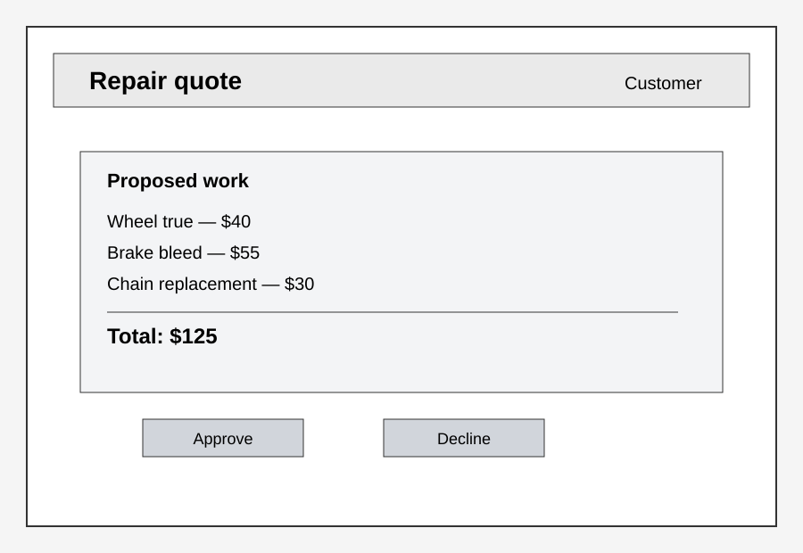
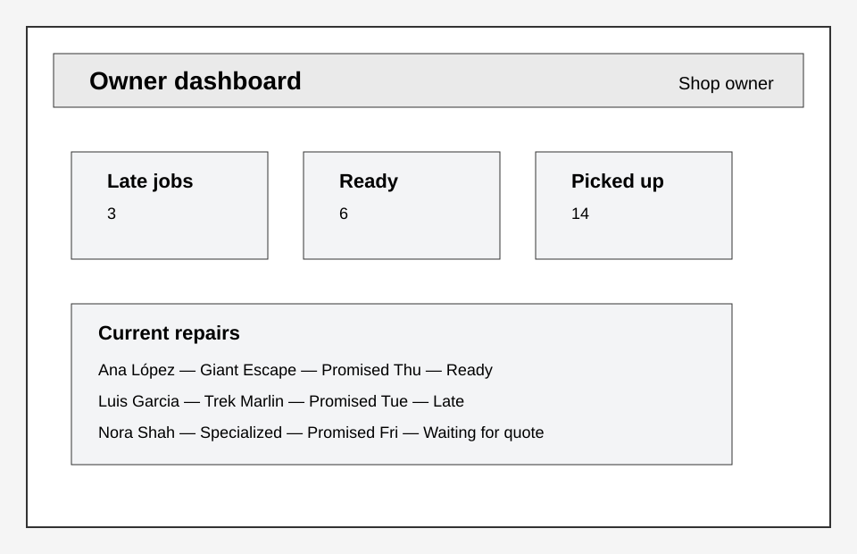
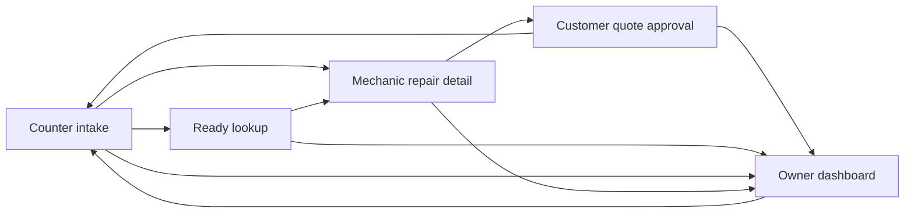

# Wireframes

## 1. Counter intake screen

Role: Counter staff

## 2. “Is this bike ready?” lookup screen

Role: Counter staff

## 3. Mechanic repair detail screen

Role: Mechanic

## 4. Customer quote approval screen

Role: Customer

## 5. Shop owner dashboard

Role: Shop owner

## Navigation graph

## Notes

- Every screen is intentionally low fidelity and intentionally plain, as required.
- The counter staff view focuses on intake, status lookup, and “is this bike ready?” decisions.
- The mechanic view focuses on diagnosis, notes, and quote preparation.
- The customer view focuses on the quoted services and the yes/no decision.
- The owner dashboard highlights overdue jobs and promised dates.
